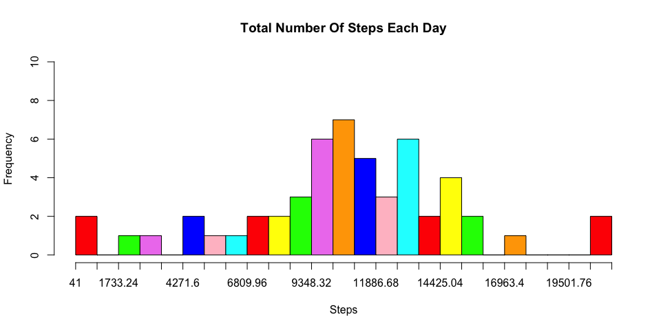
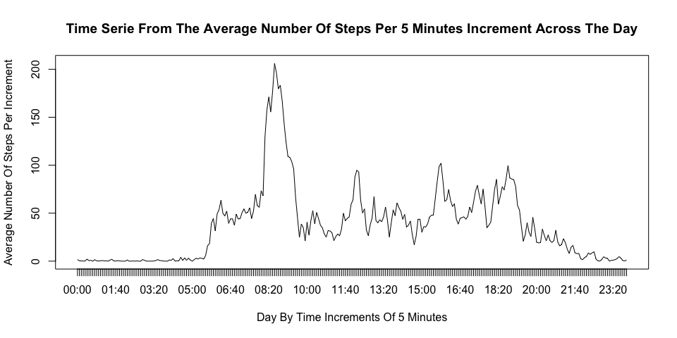
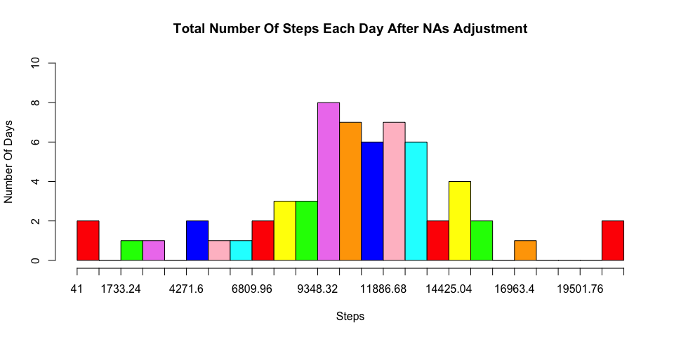

# Reproducible Research: Peer Assessment 1


## Summary

This document will detail the work done on the dataset "Activity monitoring data" which describe the data collected from a personal activity device that monitors the number of steps.This analysis is split in two parts.  
The first part (*"What is mean total number of steps taken per day?"* and *"Imputing missing values"*) shows that, when the NAs are filled there is a change in the distribution but this stays coherent with the distribution computed when the NAs are excluded.  
The second part is a time serie analysis (*"What is the average daily activity pattern?"* and *"Are there differences in activity patterns between weekdays and weekends?"*) which will show that the activity is different depending on the days of the week (weekdays or weekend) where the measurment is done.  

## Introduction

The collect of physiscal information (movment, heartbeat, ...) of a person is now possible with portable personal devices such as the [Nike Fuelband][1], the [jawbone up][2] or the [fitbit][3]. Thanks to this devices, health informations are collected but they remain underutilized because there is a lack of statistical methods and software for processing and interpreting the data. 

This document goal is to provide information contained in a dataset of steps activity for an user and to make basic analysis of them. The dataset counted the number of steps done over a period of two months (October to November 2012). The data are collected at 5 minutes interval through out the day.  

The analysis will try to answer to two questions, is there is a change in the data distribution if a default value is given to the NAs?  
And can we figure out if there is a modification of the activity depending on the day of the week where the measurment is done?  
There is four analysis parts in this document. Each part contain the information about the code used, a plot of the data after their transformation and an analysis of the plot.

There is also a part about the data collection and the transformations applied to the original dataset. 

[1]: http://www.nike.com/us/en_us/c/nikeplus-fuelband
[2]: https://jawbone.com/up
[3]: http://www.fitbit.com/

## Loading and preprocessing the data

The dataset has been downloaded from a web repository ([Download here][4]), the file is provided as a zip file. 
The zipped file must be saved in the same directory than this Rmd file. Once it is done, execute the chunk of code below.  


```r
url <- ("http://d396qusza40orc.cloudfront.net/repdata%2Fdata%2Factivity.zip")
download.file(url, 'activity.zip', mode='wb')
unzip('activity.zip')
Activity <- read.csv('activity.csv')
unlink(url)
head(Activity)
```

```
##   steps       date interval
## 1    NA 2012-10-01        0
## 2    NA 2012-10-01        5
## 3    NA 2012-10-01       10
## 4    NA 2012-10-01       15
## 5    NA 2012-10-01       20
## 6    NA 2012-10-01       25
```

The dataset has 3 variables:  

* **steps**: The number of steps measured
* **date**: The date of the measurment (61 days)
* **interval**: The interval of time at which the measurment was done (288 times per day)

I did not transform the dataset itself but I built additional subsets that I thought could be useful in the later computations.  
I copied the original dataset two times, one with only the complete cases (***Activity2***) and the other with only the NAs (***Activity.NA***). I did that to keep the original dataset untouched and to avoid the risk to corrupt the original data.  
I also converted the date and time in the correct format (***DayName*** and ***TimeFreq***).


```r
Activity1 <- Activity
Activity2 <- Activity1[complete.cases(Activity1),]
Activity.NA <- Activity1[!complete.cases(Activity1),]
IncrementDF <- Activity1[,3]
DateUnique <- unique(Activity1[,2])
DayName <- as.character(unique(weekdays(as.Date(DateUnique))))

Time_convert <- function(x,y) {
        paste(rep(x,y), sep="", collapse="")
        }
Time.temp <- mapply(Time_convert, 0, 4-nchar(unique(IncrementDF)))
Increment.time <- paste(Time.temp, IncrementDF, sep="")
TimeFreq <- format(strptime(Increment.time, 
                            format="%H%M"), format="%H:%M")

time.df <- as.data.frame(TimeFreq)
```

[4]: https://d396qusza40orc.cloudfront.net/repdata%2Fdata%2Factivity.zip

## What is mean total number of steps taken per day?

In this part I will calculate the total number of steps taken each day and draw a histogram from these values.
Finally I will also calculate the mean and median value for each value of steps.  
  
To calculate the number of steps per day I did the sum of all the values of increment for one day and I stored these values in a single data frame that I plotted. This resulted in a 61 rows data frame. 61 is the number of observations with the NA added.
I choosed to exclude the NAs from the final data frame because they will be tranformed in 0 during the plot and they will be added to the observation. This should not change a lot the distribution but this will not reflect the reality as NAs are not data.  
NA is different from 0 because it means that we don't have the information about the number of steps (maybe the device was switched off) when 0 means that we have an information, the user did not do steps (maybe the user was not wearing the device but it was still on). 
So using 0 instead of NA is equivalent to give a value to the observation which is not the purpose of this question of the asssignment. 

**NB:**  
* More information about the NAs are available in the part *"Imputing missing values"* of this document.  
* I took a sample of the untouched data (ex1) to show later that there was a modification of the NA value (cf. *"Imputing missing values"* part of this document).  


```r
sum.df <- data.frame()
for(i in unique(Activity1[,2])) {
        
        sum.df <- rbind(sum.df, 
                        sum(Activity1[Activity1$date == i,1]))
}
SumPerDayNA <- cbind(sum.df, unique(Activity1$date))
ex1 <- SumPerDayNA[1,1:2]
colnames(ex1) <- c('steps', 'date')
SumPerDay <- SumPerDayNA[complete.cases(SumPerDayNA),]
colnames(SumPerDay) <- c('sum', 'date')
head(SumPerDay)
```

```
##     sum       date
## 2   126 2012-10-02
## 3 11352 2012-10-03
## 4 12116 2012-10-04
## 5 13294 2012-10-05
## 6 15420 2012-10-06
## 7 11015 2012-10-07
```
 
The histogram has been drawn with the basic plot functions. To ease the reading I colored the bins in different colors.


```r
bins <- seq(min(min(SumPerDay[,1])), max(SumPerDay[,1]), 846.12)
colors <- c("red", "yellow", "green", "violet", "orange", "blue", "pink", "cyan") 
hist(SumPerDay[,1], 
     main='Total Number Of Steps Each Day', 
     xlab='Steps',
     xaxt='n',
     right=FALSE, 
     col=colors, 
     breaks=bins, 
     ylim=c(0,10))
axis(1, at=bins, labels=bins)
```

 
 
I choose to draw a 25 bins histogram to have a broader view of the distribution. If I've chosen less the result will have been smoothed and I will have lost some interesting information, like the outliers for instance.     From the histogram, I can note that the distribution is is unimodal, (there is only one peak); widely spread (from almost 41 steps to almost 22000 steps) and symetric. Also there is an balance between roughly 8000 and 13000 steps per day.  
The plot shows also there is five potential outliers that can't be explained with just a histogram.    
The mean and the median are calculated from the data frame.


```r
MeanPerDayNoNA <- mean(SumPerDay[,1])
MedianPerDayNoNA <- median(SumPerDay[,1])
print(MeanPerDayNoNA)
```

```
## [1] 10766.19
```

```r
print(MedianPerDayNoNA)
```

```
## [1] 10765
```

Again this result shows that the distribution is symetric.  

## What is the average daily activity pattern?

In this point, I will calculate the average number of steps per 5 minutes increments across all days and I will plot a time serie with these values.  
I will use a for loop to filter the data by the increment and I will calculate the mean for all the values returned by the filter. I will repeat this operation for all the single increments (i.e. 288 times).  
I will store all the data in a data frame that I will use for the time serie.
I didn't include the NAs.


```r
MeanPerIncrement <- data.frame()
for(i in  unique(Activity[,3])) {
        MeanPerIncrement <- rbind(MeanPerIncrement, 
                                  mean(Activity2[Activity2$interval == i,1]))
        }
MeanPerIncrement <- cbind(MeanPerIncrement, 
                          unique(time.df[,1]))
colnames(MeanPerIncrement) <- c('mean', 'Increment')
head(MeanPerIncrement)
```

```
##        mean Increment
## 1 1.7169811     00:00
## 2 0.3396226     00:05
## 3 0.1320755     00:10
## 4 0.1509434     00:15
## 5 0.0754717     00:20
## 6 2.0943396     00:25
```

The plot is a time serie done with the basic plot fuctions and the type 'l'.


```r
plot(MeanPerIncrement[,1], 
     type='l', 
     xaxt='n',
     xlab="Day By Time Increments Of 5 Minutes", 
     ylab="Average Number Of Steps Per Increment", 
     main="Time Serie From The Average Number Of Steps Per 5 Minutes Increment Across The Day")
axis(1, 
     at=c(1:288), 
     labels=as.character(unique(TimeFreq)), 
     'day')
```

 

The plot shows activities start around 05:25. Based on the time of the increment, I would assume this correspond of the wake up of the user. The biggest peak is after the start of the activities, maybe a jogging.  
All the day the activities are recorded with no high peak and they slowly decrease in the evening.  
I can't do more analysis around this plot but I will go back to it when I will talk about the split between weekday and weekend later.   
According to the plot, the maximum value of the steps is roughly around 08:40 and this value is above 200.  
To be more precise I used a data frame filter as follow.  


```r
TempMax <- MeanPerIncrement[MeanPerIncrement[,1] == max(MeanPerIncrement[,1]),]
MaxSteps <- TempMax[1,1]
MaxInc <- TempMax[1,2]
```

So the max average value of the number of steps is **206.1698113** and the increment of time at which this maximum occurs is **08:35**.

## Imputing missing values

This part will deal with the missing values (NA) in the dataset. I will first calculate the number of NA observations in the full dataset and based on this informations, the ones already computed and some temporary data, I will figure out what is the best strategy to fill these NAs with a value that will not impact too much the dataset. To confirm that I will calculate the mean and the median of the new dataset and compare them to the old values.  
 
To collect the number of NAs I used the dataset I already created (***Activity.NA***) and I returned the **nrow()**.  


```r
ValueNA <- nrow(Activity.NA)
```

The Missing value represents **2304** observation which correspond to 8 full days.  
A detailed observation of thedataset shows few things. 

* The NA are all located on the steps.  
There is no NAs on the date and the interval.  

* The NAs are grouped per day.  
There is no NAs in the middle of a day. This means that the NAs represent 2304 increments grouped in 8 days out of 61 (17568 increments).
    
* Percentage of NAs.  
13% of NAs means that we need to be careful with the strategy to fill the NA as it could have an big impact in the final results. But also it could be very useful tofill these NAs with data so it will increase the accurracy of the final analysis.  

All the observations above can lead to the assumption that the NAs represent the days where the user did not wear the measurement device or this device was switched off.  
As I wrote before, the NAs can't be taken for a value, instead they show a lack of value and they should not be added to the calculation without being filled with values extrapolated from the already known information.  
I decided to avoid the extreme values (max and min) and also the sum of the values as it will not reflect the reality. Finally I choosed to fill the NAs with an average value of the steps. Here I had two options.  

* **Mean per increment**  
This is equal to do the sum of the mean per increment.  
In this case the median number of steps will be increased(mean is almost equal to median). This will not reflect the reality as it seems unlikely that the user made almost the same number of steps for all the NAs days.  

* **Mean per day**  
This is equal to do the mean of the sum of increments.  
In this case the number of steps per day will be spread and this could change the distribution. But in the other hands this could be more realistic.  

I choosed to do a mean per day because I preferred to have a more realistic distribution even if it changes the shape of the plot.  
Furthermore the NAs are all grouped per day and so I assumed that the average number of steps during these days should be almost the same than during the same days where the measurment was done. In other words I used the following algorithm. 

<center> ***IF NAs day = day x:  
NAs = mean of all the days x*** </center> <br>   

I Added the weekday to the datasets created in the first part (i.e. ***SumPerDay*** and ***SumPerDayNA***).  
    

```r
MeanPerDay <- data.frame()

TempDay <- as.data.frame(weekdays(as.Date(SumPerDay[,2])))
TempDayNA <- as.data.frame(weekdays(as.Date(SumPerDayNA[,2])))
SumPerDay <- cbind(SumPerDay, TempDay)
SumPerDayNA <- cbind(SumPerDayNA, TempDayNA)
```

I calculated the mean per day for each days. 


```r
for(i in DayName) {
        MeanPerDay <- rbind(MeanPerDay, round(mean(SumPerDay[SumPerDay[,3] == as.character(i),1]), digits=0))
}
MeanPerDay <- cbind(MeanPerDay, DayName)
colnames(MeanPerDay) <- c('mean', 'day')
```

I Replaced the NA by the correct mean for the correct day.  


```r
TempNA <- which (is.na(SumPerDayNA))
for (i in TempNA){
        TempWeekdayNA <- SumPerDayNA[i,3]
        for (n in MeanPerDay[,2]) {
               if (identical(as.character(TempWeekdayNA), as.character(n))) {
                       SumPerDayNA[i,1] <- MeanPerDay[MeanPerDay[,2]==n,1]
                }    
        }
}
colnames(SumPerDayNA) <- c('steps', 'date', 'days')
```

As example of the result, I show the first value of the dataset. This days was a Monday and without the NA filling, the first data were NA.


```r
print(ex1)
```

```
##   steps       date
## 1    NA 2012-10-01
```

After the completion of the operation, the first value was filled with the mean value for the Monday.


```r
print(SumPerDayNA[1,1:2])
```

```
##   steps       date
## 1  9975 2012-10-01
```

I Plotted the histogram with the same graphics parameters than the one in part *"What is mean total number of steps taken per day?"* to keep the coherency between the two plots.  


```r
colors <- c("red", "yellow", "green", "violet", "orange", "blue", "pink", "cyan") 
bins <- seq(min(min(SumPerDayNA[,1])), max(SumPerDayNA[,1]), 846.12)
hist(SumPerDayNA[,1], 
     main='Total Number Of Steps Each Day After NAs Adjustment', 
     xlab='Steps', 
     ylab = 'Number Of Days',
     xaxt='n',
     right=FALSE, col=colors, 
     breaks=bins, 
     ylim=c(0,10))
axis(1, at=bins, labels=bins)
```

 

The new plot, compared to the previous one, shows an increase in the range between roughly 8000 and 13000 steps. The values reported by the MeanPerDay data frame explain this behavior.  


```r
print(MeanPerDay)
```

```
##    mean       day
## 1  9975    Monday
## 2  8950   Tuesday
## 3 11791 Wednesday
## 4  8213  Thursday
## 5 12360    Friday
## 6 12535  Saturday
## 7 12278    Sunday
```

The range 10000 to 13000 steps is increased by 5 new obeservations and the range of 8000 to 10000 steps is increased by 3.  
The plot is still showing a central range between roughly 8000 and 13000 steps, but this time there is an uniformisation where each bins are almost of the same frequency. 
Also I noticed that the outliers are untouched, which is normal because no modifications were done in the extreme values.  
I calculated the mean and median and I compared them to the previous values.


```r
options(scipen=999)
MeanPerDayNA <- mean(SumPerDayNA[,1])
MedianPerDayNA <- median(SumPerDayNA[,1])
```

The mean and the median show slight variations compare to the previous values. 

- Previous Values    
    * Mean: 10766.19 (10766.1886792)  
    * Median: 10765  
- New Values     
    * Mean: 10821.23 (10821.2295082)  
    * Median: 11015    
      
The variation between the old and new values are of 0.51% for the mean and 2.32% for the median.  
If the variation between the new mean and median was increased.  
This change (median > mean) could indicate that the histogram is now right-skewed but this difference is not important enough to confirm that and because of the uniformisation in the middle range, this plot is still symetric.  
This plot show some such strong similarities with the previous one than it is possible to conclude that filling the NAs didn't change the plot.

## Are there differences in activity patterns between weekdays and weekends?

This part will analyse the potential difference between the measurment done in point 2 (mean per increment) and the relationship between the weekday and the weekend.  

The computation of the information is done on the average number of steps per time increment. As I worked on the dataset with the NAs filled but because I choosed another strategy to fill the NAs (use of the average steps per day), I don't have a dataset with the NAs time increments filled and I had to rebuild it from scratch. To do that I recycled the code I used in the part *"Imputing missing values"*. I've added a new column in the dataset to indicate if a day is a weekday.  

I Filled the NAs with the mean per increment already computed in the part "Average Daily Pattern". I recycled the code alredy used for the part *"Imputing missing values"* and so the NAs are filled with the mean of the same complete increment (00:00 -> 00:00, 00:05 -> 00:05 ...) 


```r
WeekEnds <- c('Saturday', 'Sunday')
WeekDays <- DayName[! DayName %in% WeekEnds]

DaysOfActivity <- cbind(Activity, weekdays(as.Date(Activity[,2])), time.df[,1])
TempNA <- which (is.na(DaysOfActivity))
for (i in TempNA){
        TempIncNA <-  DaysOfActivity[i,5]

        for (n in MeanPerIncrement[,2]) {
               if (identical(as.character(TempIncNA), as.character(n))) {
                       DaysOfActivity[i,1] <- MeanPerIncrement[MeanPerIncrement[,2]==n,1]
                }    
        }
}

DaysOfActivity[DaysOfActivity[,4] %in% WeekDays, 6] <- 'Weekday'
DaysOfActivity[DaysOfActivity[,4] %in% WeekEnds, 6] <- 'Weekend'
colnames(DaysOfActivity) <- c('steps', 'date', 'interval', 'days', 'time', 'day_of_the_week')

IncrementPerWeekday <- data.frame()
for(i in  unique(DaysOfActivity[,2])) {
        IncrementPerWeekday <- rbind(IncrementPerWeekday, sum(DaysOfActivity[DaysOfActivity[,2] == i,1]))
}
```

I split the data frame in two, one for the weekdays and the other for the weekends. I calculated the mean for each increment for each data frame.


```r
IncrementPerWeekday <- data.frame()
IncrementPerWeekend <- data.frame()

WeekdaysOfActivity <- subset(DaysOfActivity, day_of_the_week == "Weekday", select=c(steps, time))
WeekendsOfActivity <- subset(DaysOfActivity, day_of_the_week == "Weekend", select=c(steps, time))

for(i in  unique(WeekdaysOfActivity[,2])) {
        IncrementPerWeekday <- rbind(IncrementPerWeekday, mean(WeekdaysOfActivity[WeekdaysOfActivity[,2] == i,1]))
}

for(i in  unique(WeekendsOfActivity[,2])) {
        IncrementPerWeekend <- rbind(IncrementPerWeekend, mean(WeekendsOfActivity[WeekendsOfActivity[,2] == i,1]))
}
```

I used the same graphical parameters than the ones in *"What is mean total number of steps taken per day?"* to draw the time series.


```r
par(mfrow = c(2,1))

par(mar = c(bottom=1.5, 5.1, top=4, 2.1))
plot(IncrementPerWeekday[,1], 
     type='l', 
     xaxt='n',
     xlab='',
     ylab="Average Number Of Steps",
     main="Average Steps Number Per Weekdays")
axis(1, 
     at=c(1:288), 
     labels=as.character(unique(TimeFreq)), 
     'day')

par(mar = c(bottom=4, 5.1, top=5, 2.1))
plot(IncrementPerWeekend[,1], 
     type='l', 
     xaxt='n',
     xlab='',
     ylab="Average Number Of Steps",
     main="Average Steps Number Per Weekend")
axis(1, 
     at=c(1:288), 
     labels=as.character(unique(TimeFreq)), 
     'day')
```

 

The plot shows that there is a relation between the days of the week and the activity. The activity is more important during the early morning in the weekdays. This seems to show that the user is someone who do sport in the morning because the maximum steps is in the morning (206.17, 08:35). This maximum is reached only during the weekdays as the cross comparison between the plots can show. Also the peaks during the working hours are see are located in the weekend plot.  
One assumption that can explain this is if the user of the device is potentially an office worker (low steps during the working hours in the weekdays) doing his/her sport before going to work. It is diffcult with only these plots to figure out why there is an increase in the steps number during the working hours of the weekend but one assumption can be that the user is active during the weekend doing some external activity.
